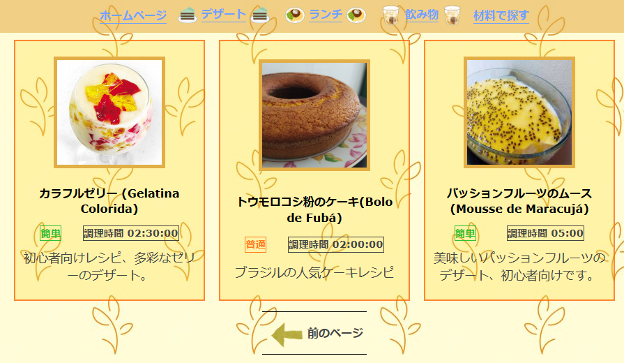
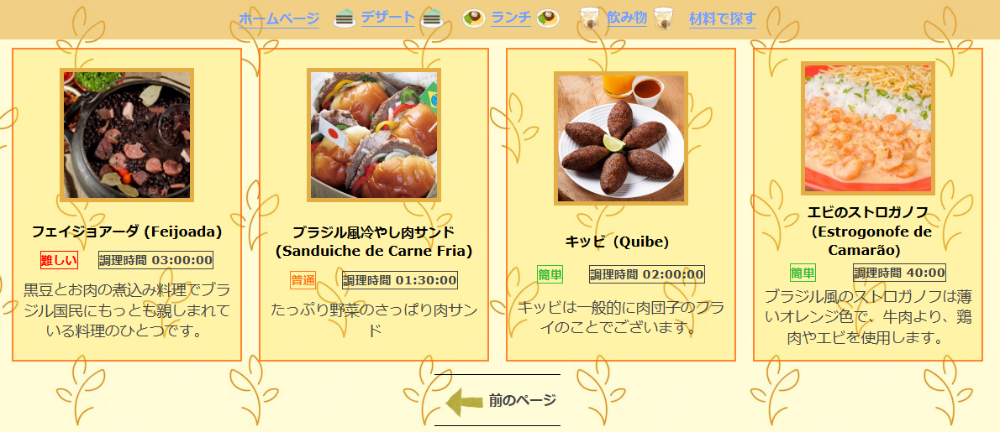
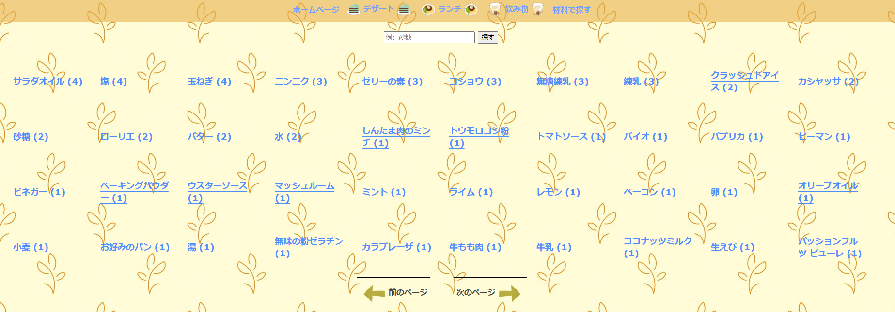
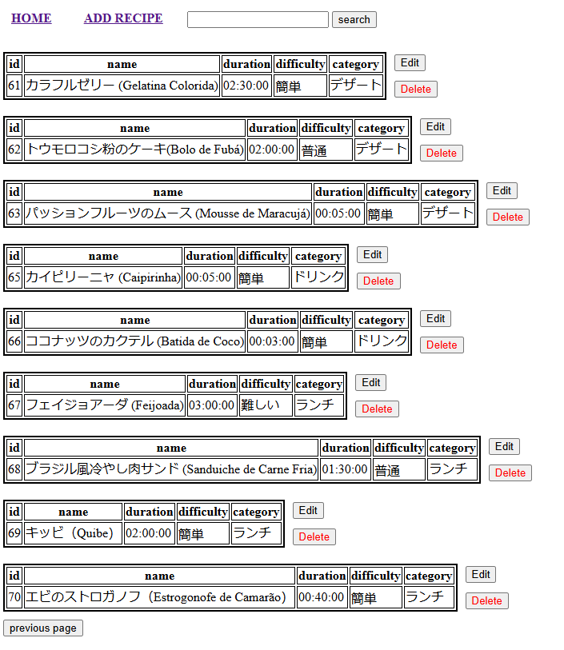
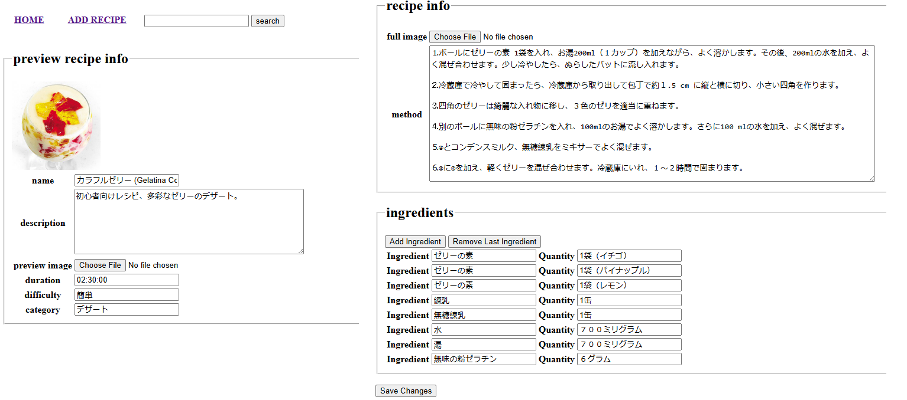

<h1>Recipe Site</h1>

(Database info: database/login_db.php)

(Manager info: manager/login_info.php)

In order to create all tables you must run database/setup.php after creating both user and database according to the database/login_db.php information.

i've made this simple site in order to practice both PHP and my japanese skills. It is a japanese recipe site, where you can upload and search for recipes according to ingredient, category and name

 

(terminal) <code>php -S address:port</code> in order to run

 
<h2>Images</h2>

